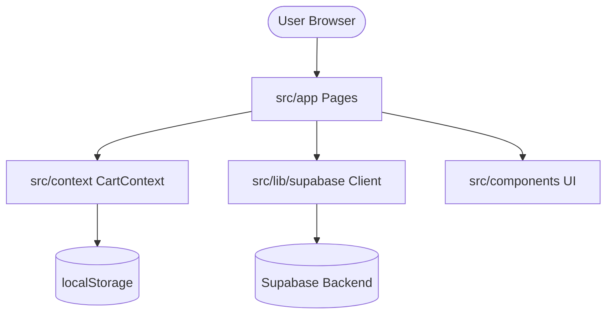

# Architecture Deep Dive: 3G-Wine

## Overview
3G-Wine is a modern e-commerce platform for wines, built with Next.js, TypeScript, and Supabase. The architecture follows a modular approach centered around the Next.js App Router.

## Core Pillars

### 1. State Management
The application uses the **React Context API** for global state.
- **CartContext**: Manages the shopping cart lifecycle, including persistence to `localStorage`.
- **Key Location**: `src/context/CartContext.tsx`

### 2. Backend & Data Layer
- **Supabase**: Primary database and authentication provider.
- **Client Initialization**: `src/lib/supabase.ts`
- **Environment Variables**:
  - `NEXT_PUBLIC_SUPABASE_URL`
  - `NEXT_PUBLIC_SUPABASE_ANON_KEY`

### 3. Routing & Pages
Utilizes **Next.js App Router** (`src/app`).
- **Middleware**: `src/middleware.ts` handles request-level logic (likely auth protecting certain routes).
- **API Routes**: Located in `src/app/api`.

### 4. Components & UI
- **Styling**: Vanilla CSS (based on project preferences) within `src/components`.
- **Atomic Principles**: Components are grouped in `src/components`, separating UI from logic.

## Module Interaction

## Security
- All sensitive keys must be managed via `.env` files.
- Middleware ensures route-level protection.
